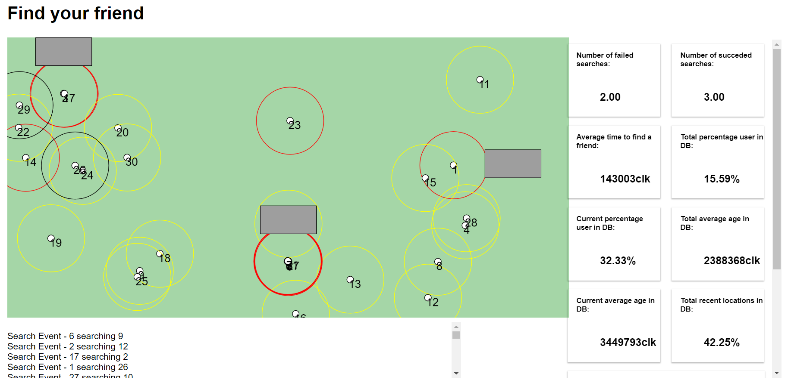

# Simulator of WTF (Wearable Ticket for Festivals)
This repository contains the code to simulate the runtime behavior and performances of an embedded system. In our case the embedded system is a bracelet, which is worn by festival guests and allows them to find their friends by means of a P2P network of bracelets. More on this in the [paper](final_paper.pdf)

This project was carried out as final project for the DTU course, Fundamentals of Modern Embedded Systems [02223](http://kurser.dtu.dk/course/02223)

## Introduction

The simulator is split into

* Backend (Simulator)
* Frontend (Web UI)

## Backend/Simulator

Make sure maven is installed on the host

Open the terminal in the root folder and run the following command
    
    mvn package

## Usage

The simulator can simulate two communication algorithms:

* Broadcast ([video](https://www.youtube.com/watch?v=M3T-7G0hFfM&index=2&list=UUVtdSuG76pmr0tgl--oJcCQ))
* Search Request ([video](https://www.youtube.com/watch?v=a4ASGlVInRo&index=1&list=UUVtdSuG76pmr0tgl--oJcCQ))

More on this in the paper.

In order to run the change the mode it is necessary to change _runSR_ boolean value in _Simulator_ class:

    @PostConstruct
	public void start() {
		new Thread(() -> {
			try {
				Thread.sleep(5000);
				boolean runSR = true;
                ...

The configurations for the events and properties of the system and bracelet are defined in [resources](backend/src/main/resources):

* event.txt (what happens in the system)
* params.txt (the characteristics of the bracelet in Braodcase)
* SRparams.txt (the characteristics of the bracelet in Search Request)
            

### Running the simulator

    java -jar ./backend/target/*.jar

### The HTTP interface

The Simulator will expose internal information and statistics through a REST API. The default port is 8080.

## Frontend (Web UI)

It is developed in Javascript, using the library [P5](https://p5js.org/). It is enough to open [this file](./UI/index.html) in the browser, once the simulator is running. The UI and the simulator talk using REST APIs. The default port both use is 8080. Change it in both if necessary.

A preview of the UI, along with many statistics :

## License
The package is Open Source Software released under the [MIT](LICENSE) license.
